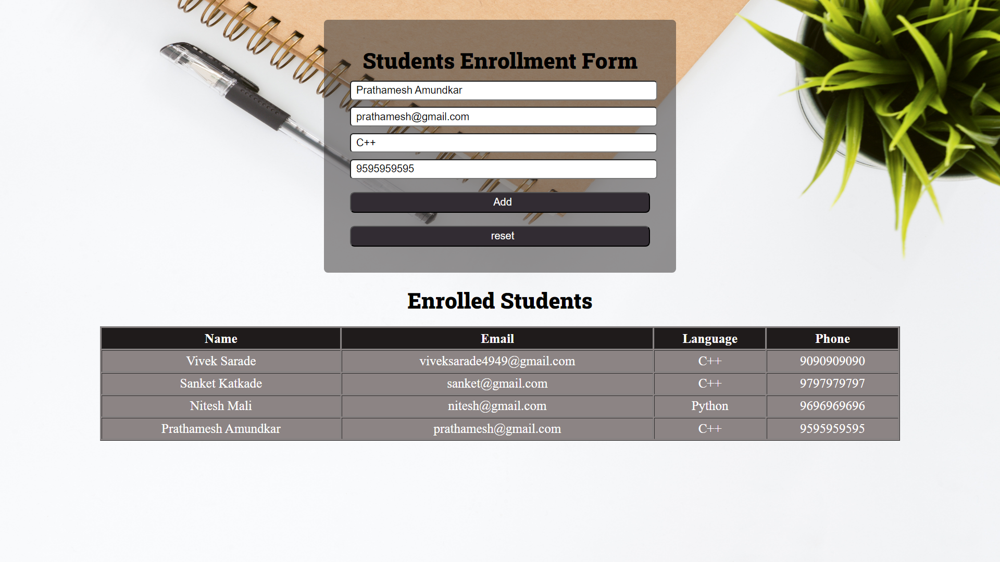
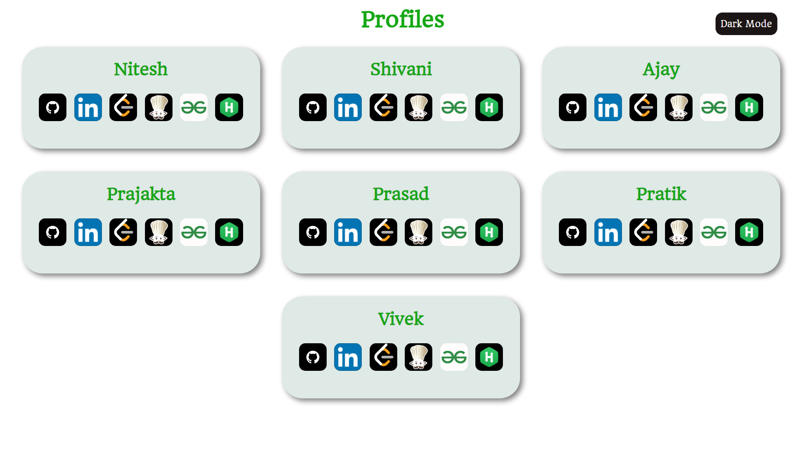
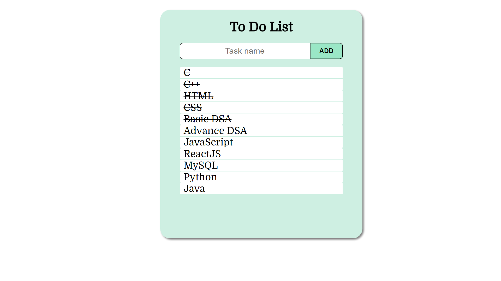

# **My Projects**

<h1 align="center">Restio</h1>

Restio is a simple Restorent website, created by using the HTML and CSS...

Technologies Used - HTML and CSS.

Deployment [Link](https://mr-vicky.github.io/Restio/) 

code [Link](https://github.com/mr-vicky/Restio)

<h1 align="center">Students Registration Form</h1>

This Registration Form is a simple website, created by using the HTML, CSS and JavaScript...

Technologies Used - HTML, CSS and JavaScript.

Deployment [Link](https://mr-vicky.github.io/LGMVIP-Task-2/) 

code [Link](https://github.com/mr-vicky/LGMVIP-Task-2)

<h1 align="center">Profiles</h1>

This is a simple website where all my and my friends' profiles are listed, created by using HTML and CSS...

Technologies Used - HTML and CSS.

Deployment [Link](https://mr-vicky.github.io/Profiles/) 

code [Link](https://github.com/mr-vicky/Profiles)

<h1 align="center">To-Do-List</h1>

This is a simple To-Do-List web app where you can add and delete the tasks, created by using HTML, CSS and JavaScript...

Technologies Used - HTML, CSS and JavaScript.

Deployment [Link](https://mr-vicky.github.io/LGMVIP-Task-1/) 

code [Link](https://github.com/mr-vicky/LGMVIP-Task-1)
